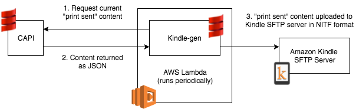

# Kindle-gen

Publishing our print-sent content to the Amazon Kindle API.

## Architecture



<!-- TODO Fix the diagram:
2. Content returned as "JSON" => "Thrift"
3. Content uploaded to "SFTP server" => "S3"
-->

This application runs as an AWS Lambda, configured via [a CloudFormation template](cfn.yaml).
It then queries CAPI for print-sent content, i.e. content published in the printed newspaper.
The content is transformed into [News Industry Text Format (NITF)](https://iptc.org/standards/nitf/)
that is indexed into RSS feeds. The output is stored in AWS S3 and exposed publicly to be consumed
by Amazon's
[Kindle Publishing for Periodicals (KPP)](https://kindlepublishing.amazon.com/gp/vendor/kindlepubs/kpp/kpp-home)
in order to be published on the
[Kindle Newsstand](https://www.amazon.co.uk/Magazines-Journals-Kindle/b?ie=UTF8&node=341690031).


## Design

The application has been designed with extensibility in mind. It should be possible to use its
core, unmodified, to support the generation of different newsletters. The Guardian's Kindle Edition
is one example that is baked into this repository.

### The Core
The main entry point is `KindleGenerator`. It accepts an `ArticlesProvider` that is responsible
for providing the HTML articles to be published in the edition. An example implementation is the
`DailyWeatherForecastProvider`.

With the provided articles, the `KindleGenerator` proceeds to (optionally) download the articles'
main images. It accepts a `Downloader`, such as `OkHttpSttpDownloader`, to give the caller full
control over downloading options. There is a test to check that there are enough articles.

Following this, the `KindleGenerator` divides the articles into sections using a `BookBinder`.
The standard implementation is `MainSectionsBookBinder`, which
[supports customisation](src/main/resources/guardian-sections.conf) of section names and section
order, as well as combining multiple sections into one.

The next step is to convert the articles into a format supported by the Kindle publishing platform.
We use NITF as one of the
[formats supported by KPP](https://images-na.ssl-images-amazon.com/images/G/01/kindle-publication/feedGuide-new/KPPUserGuide.html).
The logic for this transformation starts with `ArticleNITF`, which converts the HTML into XHTML,
cleans it to remove external links, and uses `XhtmlToNitfTransformer` to convert the XHTML into
valid NITF.

Because different versions of NITF may support different tags, and because
[KPP's version of NITF](src/main/resources/kpp-nitf-3.5.7.xsd) has custom extensions, the
`XhtmlToNitfTransformer` uses `NitfConfig` and `HtmlToNitfConfig` to abstract away the knowledge of
NITF versions. Concrete implementations of `KindleNitfConfig` and `KindleHtmlToNitfConfig` have been
configured with the KPP-specific extensions.

The NITF outputs are then saved to a `Publisher`, which gets to decide where and how to publish
the generated files. In the tests, we use a `FilePublisher`.

Finally, one `RssManifest` is generated for each section, and a main RSS manifest is generated to
point to the other manifests. These manifests are saved to the `Publisher`.

### The Guardian's App
The Guardian's Kindle-Gen app lives in an AWS Lambda.

The main entry point is the `Lambda` class in the `app` package. Its purpose is to wire up the
application and configure its settings correctly.

We use the `GuardianArticlesProvider` and a `DailyWeatherForecastProvider`, with the latter
configured to use an `AccuWeatherClient`.
Files are published using an `S3Publisher` that also manages public redirects.

The `Lambda` starts by reading configuration from its parameters, environment variables, and
Typesafe Config (including system properties and configuration files). Then it checks if the time
is right to run (or if the run is forced), because it may be invoked at other times to support
daylight saving.

Following this, the `Lambda` removes the public redirect to the last edition and attempts to
generate a new edition. If this is successful, then a new redirect is mapped to the new edition.


## Configuration

Each component declares its required configuration parameters in its constructor or factory method.
These can be in the form of individual properties or, more commonly, a "Settings" case class in the
same package. Typically, an application would read these settings from a configuration file.

The main configuration file is [reference.conf](src/main/resources/reference.conf). It is written
using the [HOCON](https://github.com/lightbend/config/blob/master/HOCON.md) syntax, which is a
superset of JSON. Configuration can be customised using an
[application.conf](src/main/resources/application.conf) file, as described in the documentation of
the [Typesafe Config](https://github.com/lightbend/config) library.

In most cases, the configuration is parsed using
[Ficus' `ArbitraryTypeReader`](https://github.com/iheartradio/ficus#arbitrary-type-support),
so that the configuration properties have the same names as the settings class fields.
Special cases can be found in [app/Settings.scala](src/main/scala/com/gu/kindlegen/app/Settings.scala).

The [`app.Lambda`](src/main/scala/com/gu/kindlegen/app/Lambda.scala) has special logic to customise
configuration settings. In particular, it accepts additional configuration in an environment variable,
which can be used to override the values in the configuration file.
The class also modifies the output directory to include the edition date, which is retrieved from
the `Lambda`'s parameters.

There are a few keys required to run and to test the application. You can find them documented in
[reference.conf](src/main/resources/reference.conf). Each key in this file shows where you can get
one for your use. You can add these keys to your
[application.conf](src/main/resources/application.conf). Please do _not_ commit this file.

To support Continuous Integration servers, the test keys can be supplied via environment variables.
Check [test/reference.conf](src/test/resources/reference.conf) for details.

AWS configuration resides in a [CloudFormation file](cfn.yaml).

## Running on AWS
The application is [configured](cfn.yaml) to run daily, using the parameters defined in the
CloudFormation stack. To make persistent changes to the application's configuration, please
update the stack parameters.

To run the application manually, open the AWS Lambda and configure a test event like this:
```json
{
  "date": "2018-06-29",
  "forceRun": "true"
}
```
The `forceRun` parameter is required to tell the Lambda that it's safe to run outside its normal schedule.

The `date` parameter is optional; if it's missing then the application will use today's date.

In the **Environment Variables** section, it's possible to modify the `ConfigSettings` variable to
customise the behaviour of the lambda on the fly.

The results will be stored in the S3 bucket, and the bucket's `CurrentIssue` redirect will point
to the generated data. Depending on the date you use, this may be different from today's data.

## Development
This repository contains a standard [sbt project](build.sbt).

To run tests, simply use `sbt test`. Make sure you have an `application.conf`
[configured](#configuration) with the required keys.
